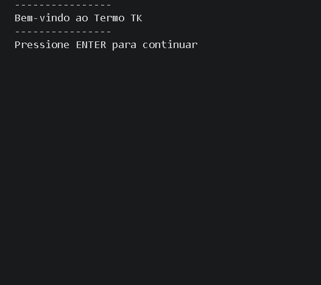

# 🎮 Jogo Termo - Console Application

  

> Uma imitação do jogo **Termo** desenvolvida em **C# para console**.

---

## 📖 Sobre o projeto

Este projeto é uma **versão inspirada no jogo Termo**, desenvolvida como uma aplicação de console em **C#**.

Diferente da versão tradicional, que pode possuir várias palavras por rodada, esta aplicação trabalha com **apenas uma palavra por partida**.

O objetivo é proporcionar uma experiência semelhante ao jogo original, focando na lógica de programação, manipulação de strings e estruturação orientada a objetos.

---

## ⚙️ Como funciona

O programa realiza as seguintes etapas:

- Gera uma **palavra aleatória** a partir de um array interno de palavras
- Solicita ao usuário que digite uma tentativa
- Valida se a palavra digitada possui **exatamente 5 letras**
- Compara a tentativa do usuário com a palavra sorteada
- Exibe o resultado da comparação no console

---

## 🧠 Regras implementadas

✔️ Palavra aleatória gerada automaticamente  
✔️ Validação de entrada com **5 caracteres obrigatórios**  
✔️ Comparação entre a palavra sorteada e a entrada do usuário  
✔️ Estrutura organizada utilizando **classes e métodos separados**
✔️ Sistema de tentativas
✔️ Indicação visual de letras corretas
✔️ Controle de letras em posições corretas
✔️ Histórico de tentativas

---

## 🏗️ Estrutura do código

O programa foi desenvolvido utilizando uma **estrutura baseada em classes**, com o objetivo de facilitar o entendimento e a manutenção do código.

Toda a lógica foi separada em métodos específicos para melhorar a legibilidade, seguindo boas práticas de programação orientada a objetos.

Além disso:

- As funções possuem responsabilidades bem definidas
- As variáveis possuem nomes claros e intuitivos
- O código está **bem documentado** para facilitar a compreensão

Essa organização torna o projeto ideal para estudos e evolução futura.

---

## 💻 Tecnologias utilizadas

- C#
- .NET
- Console Application

---

## 🚀 Possíveis melhorias futuras

- Sistema de pontuação
- Dificuldades diferentes

---

## 👨‍💻 Autor

Achei que Seria mais Dificil 💯 || Projeto desenvolvido por **Thiago Kovalski**
